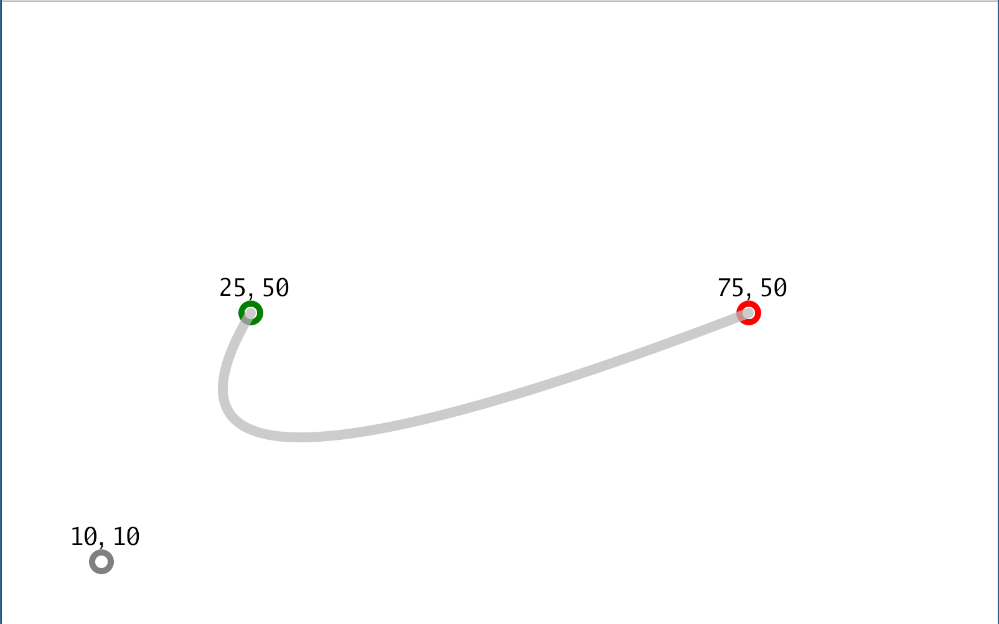
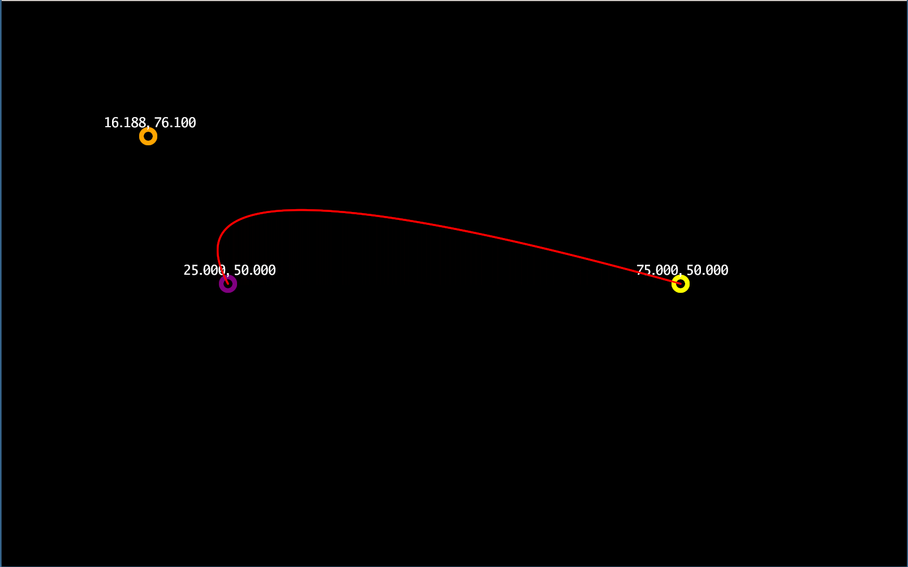

# bezsketch

Sketch quadratic bezier curves

* Primary pointer press: define begin point
* Secondary pointer press: define ending point
* Tertiary pointer press: show the decksh curve spec
* Move: define control point

command flags:

	  -begincolor string
	    	begin coordinate color (default "green")
	  -bgcolor string
	    	background color (default "white")
	  -controlcolor string
	    	control coordinate color (default "gray")
	  -csize float
	    	coordinate size (default 1.25)
	  -curvecolor string
	    	curve color (default "#aaaaaaaa")
	  -curvesize float
	    	curve size (default 1)
	  -endcolor string
	    	end coordinate color (default "red")
	  -height int
	    	canvas height (default 1000)
	  -precision int
	    	coordinate precision
	  -textcolor string
	    	text color (default "black")
	  -tsize float
	    	text size (default 2.5)
	  -width int
	    	canvas width (default 1000)

