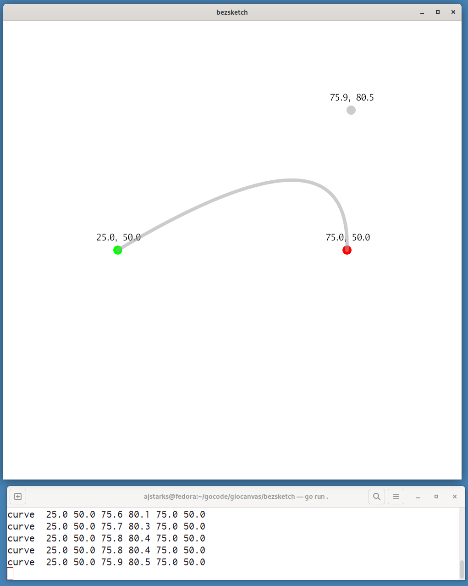

# bezsketch

Sketch quadratic bezier curves

* Button 1: define begin point
* Button 2: define ending point
* Drag: define control point

command flags:

	-width n : canvas width
	-height n : canvas height

