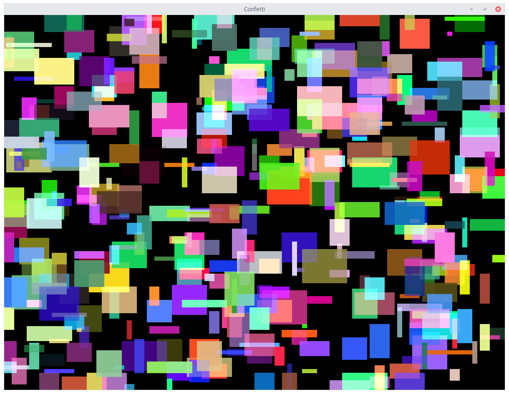

# confetti


```
Usage:
  -height int
        canvas height (default 900)
  -n int
        number of shapes (default 500)
  -size int
        max size (default 10)
  -width int
        canvas width (default 1200)

```