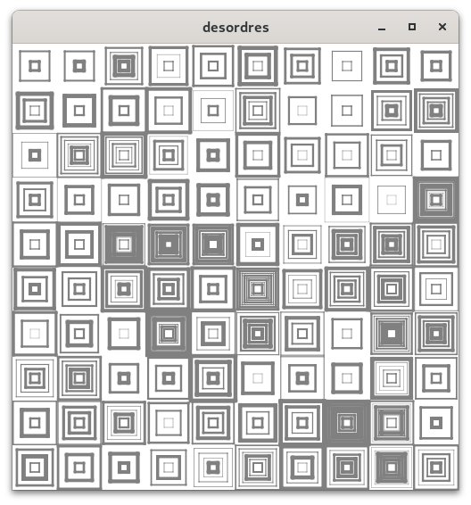
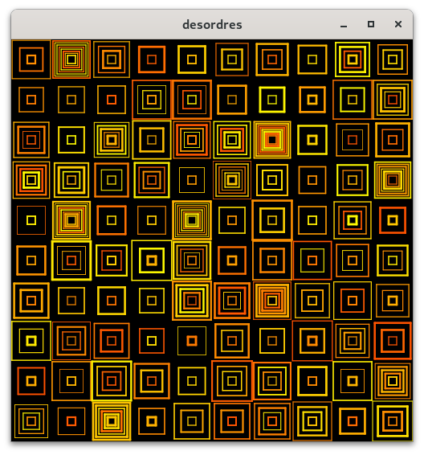

# decordres -- concentric squares in the manner of Des Ordres by Vera Molnár



```
desordres -width=500 -height=500 
```



```
desordres -width=500 -height=500 -maxlw=0.5 -bgcolor=black -color='20:60'
```


## interaction

* Primary Mouse, Right or Up Arrow: increase tiles/row
* Secondary Mouse, Left or Down Arrow: decrease tiles/row
* Home: minimum tile/row: 1
* End: maximum tile/row: 20

Pressing any other key will create a new set of tiles

## options

```
  -tiles float
    	tiles/row (default 10)
  -maxlw float
    	maximum line thickness (default 1)
  -bgcolor string
    	background color (default "white")
  -color string
    	pen color; named color, or h1:h2 for a random hue range hsv(h1:h2, 100, 100) (default "gray")
  -width int
    	canvas width (default 1000)
  -height int
    	canvas height (default 1000)
```
