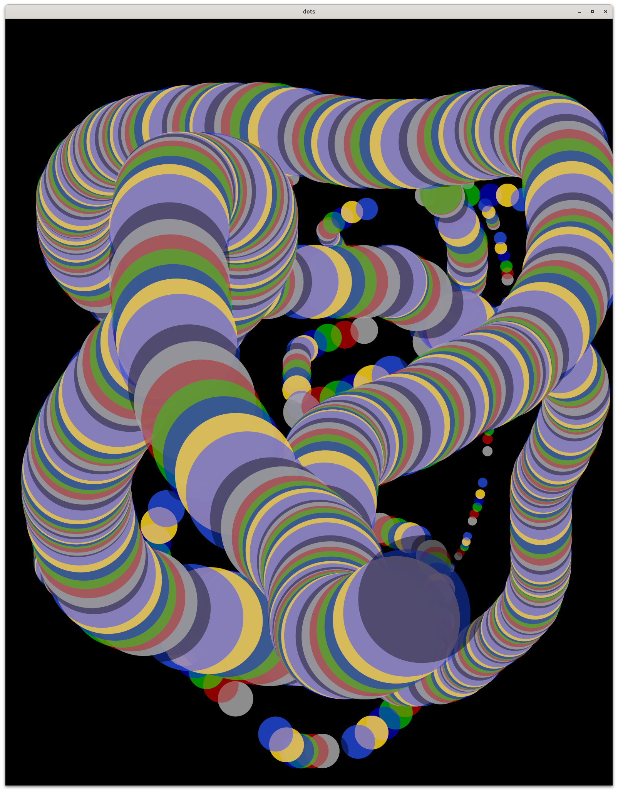

# dots

Drag the mouse and make dots



## command line

```
  -bgcolor string
    	background color (default "black")
  -palette string
      color palette (space separated list of colors) 
      (default "#aaaaaaaa #aa0000aa #00aa00aa #0000aaaa #ffd821aa #234ad5aa #ffad5e00 #000000aa")
      colors may be spefied as named colors, rgb(r,g,b,[alpha]), #rrggbb[aa], or hsv(hue,sat,value,[alpha])
  -height int
    	canvas height (default 1000)
  -width int
    	canvas width (default 1000)
  -nc int
    	number of dots (default 1000)

```

## interactions

* up,right arrow: increase dot size
* down,left arrow: decrease dot size
* Q, Esc: quit

