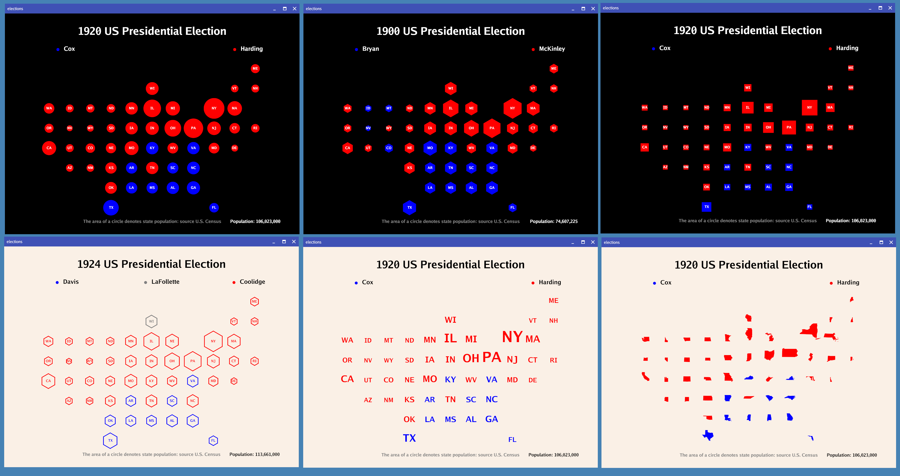

# Elections


# usage

```
 -bgcolor string
        background color (default "black")
  -colsize float
        column size (canvas %) (default 7)
  -height int
        canvas height (default 900)
  -left float
        map left value (canvas %) (default 15)
  -rowsize float
        rowsize (canvas %) (default 9)
  -sans string
        sans font (default "Go-Regular")
  -shape string
        shape for states:
        "c": circle,
        "h": hexagon,
        "s": square
        "l": line
        "g": geographic
        "p": plain text (default "c")
  -symbol string
        symbol font (default "stateface")
  -textcolor string
        text color (default "white")
  -top float
        map top value (canvas %) (default 75)
  -width int
        canvas width (default 1200)
```