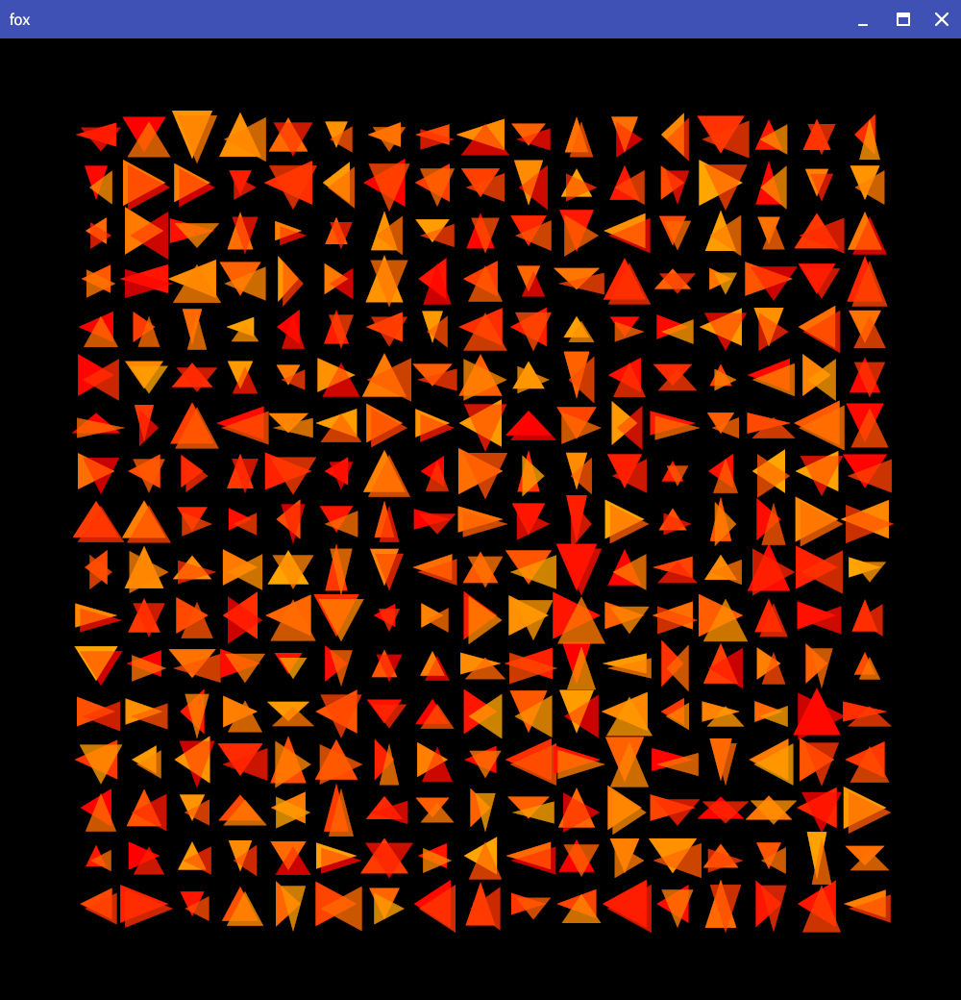
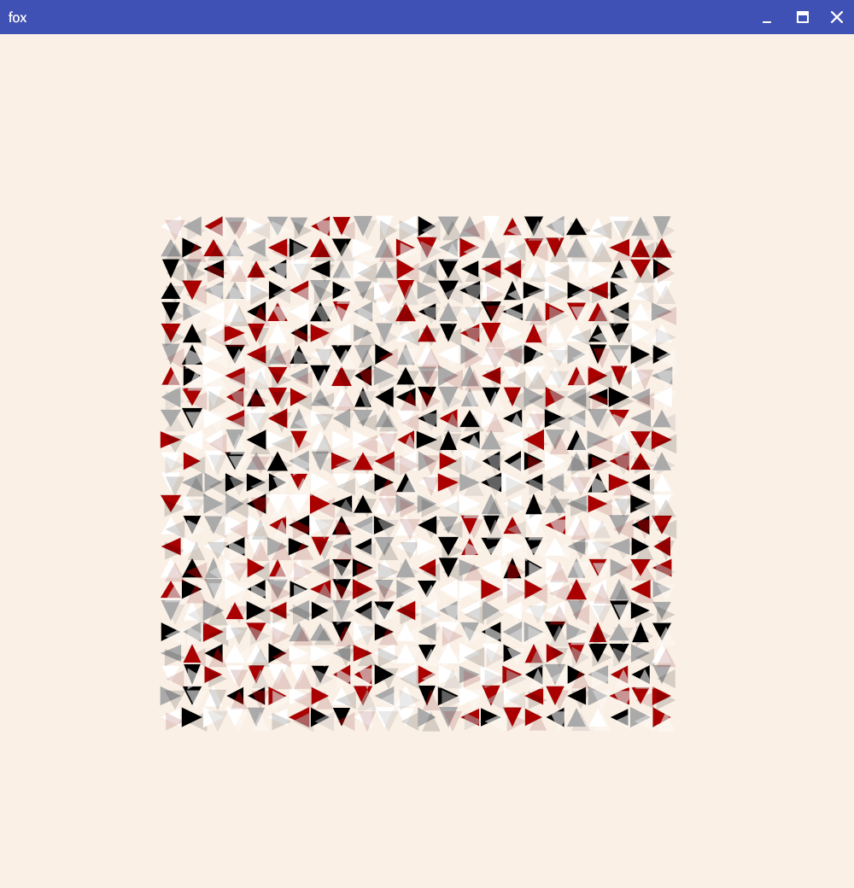
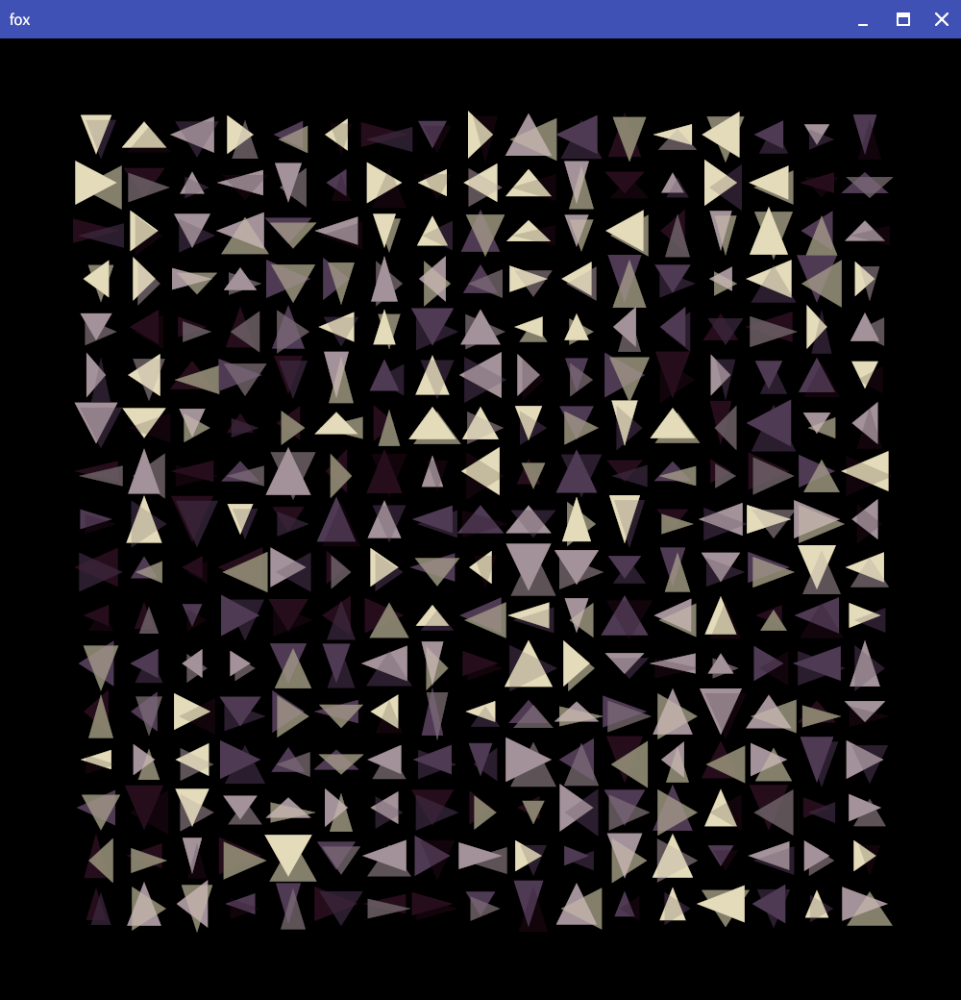

# fox -- inspired by "Fox I" by Anni Albers (using deck markup)



```fox -color 0:40 -shadow 60 -bgcolor black```



```fox -p ajs.pal -color ajstarks -w 20,80,2.5 -h 20,80,2.5  -shadow 30 -bgcolor linen```



```fox  -w 5,95,1.25 -h 5,95,1.25 -color pen-n-paper  -shadow 30 -bgcolor black```


```fox -p ajs.pal -color rainbow```

## options

```

Option      Default     Description
.....................................................
-help       false       show usage
-width      1000        canvas width
-height     1000        canvas height
-shadow     40          shadow shape opacity
-xshift     0.5         shadow x shift
-yshift     -0.5        shadow y shift
-w          10,95,5     percent begin,end,step for the width
-h          10,95,5     percent begin,end,step for the height
-p          ""          palette file
-bgcolor    white       background color
-color      gray        color name, h1:h2, or palette:

2-bit-grayscale     	#000000 #676767 #b6b6b6 #ffffff
ayy4                	#00303b #ff7777 #ffce96 #f1f2da
2-bit-demichrome    	#211e20 #555568 #a0a08b #e9efec
blk-aqu4            	#002b59 #005f8c #00b9be #9ff4e5
kirokaze-gameboy    	#332c50 #46878f #94e344 #e2f3e4
nintendo-gameboy-bgb	#081820 #346856 #88c070 #e0f8d0
ice-cream-gb        	#7c3f58 #eb6b6f #f9a875 #fff6d3
dark-mode           	#212121 #454545 #787878 #a8a5a5
links-awakening-sgb 	#5a3921 #6b8c42 #7bc67b #ffffb5
moonlight-gb        	#0f052d #203671 #36868f #5fc75d
arq4                	#ffffff #6772a9 #3a3277 #000000
mist-gb             	#2d1b00 #1e606e #5ab9a8 #c4f0c2
hollow              	#0f0f1b #565a75 #c6b7be #fafbf6
red-brick           	#eff9d6 #ba5044 #7a1c4b #1b0326
blu-scribbles       	#051833 #0a4f66 #0f998e #12cc7f
pen-n-paper         	#e4dbba #a4929a #4f3a54 #260d1c
nintendo-super-gameboy	#331e50 #a63725 #d68e49 #f7e7c6
kankei4             	#ffffff #f42e1f #2f256b #060608
rustic-gb           	#2c2137 #764462 #edb4a1 #a96868
pokemon-sgb         	#181010 #84739c #f7b58c #ffefff
spacehaze           	#f8e3c4 #cc3495 #6b1fb1 #0b0630
nostalgia           	#d0d058 #a0a840 #708028 #405010
```