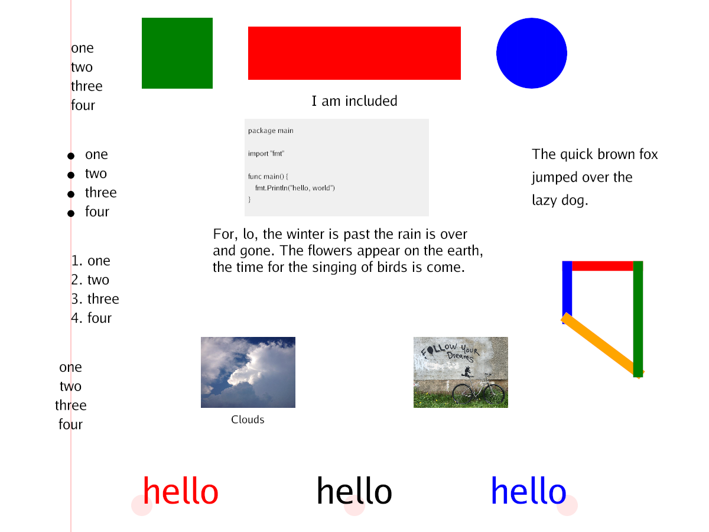

# gcdeck




## Interactions

n,k,Pointer left button: next slide
p,j,Pointer right button: previous slide
f,Pointer middle button: first slide
ESC,q: Quit

## Options

```
gcdeck [options] file

Options:

  -page int
    	initial page (default 1)
  -pagesize string
    	pagesize: w,h, or one of: Letter, Legal, Tabloid, A3, A4, A5, ArchA, 4R, Index, Widescreen (default "Letter")
  -title string
    	slide title
```