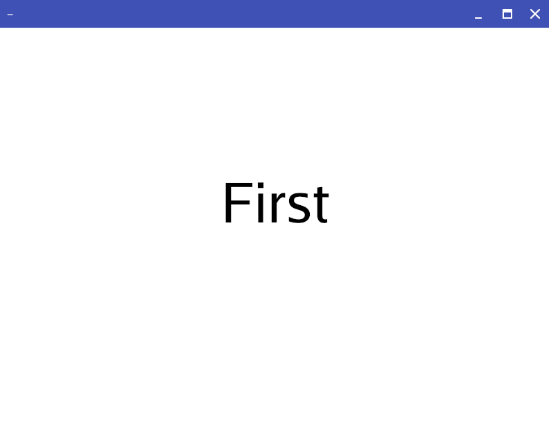

# gcdeck

Interactive deck client.

gcdeck shows slide decks formatted in the [```deck``` markup language](https://github.com/ajstarks/deck/blob/master/README.md). 

Markup is usually generated with the [```decksh``` command](https://github.com/ajstarks/decksh/blob/master/README.md)


```gcdeck t.xml``` makes:


```decksh test.dsh | gcdeck - ```




## Keyboard commands

| Command                                       | Action          |
| --------------------------------------------  | --------------- |
| A, Ctrl-A, ^, 1, Home                         | first slide     |
| E, Crtl-E, $, End                             | last slide      |
| K, F, Ctrl-F, Ctrl-N, Space, Enter            | next slide      |
| J, B, Ctrl-B, Ctrl-P, Shift-Space, Shift-Enter| previous slide  |
| G                                             | toggle a grid   |
| Q, ESC                                        | Quit            |

```gcdeck``` notices when the input file changes, and refreshes on the next interaction.

## Mouse interactions

| Button  | Action          |
| ------- | --------------- |
| Left    | next slide      |
| Right   | previous slide  |
| Middle  | first slide     |

## Options

```
gcdeck [options] file ("-" for standard input)

Options:

  -page int
    	initial page (default 1)
  -pagesize string
    	pagesize: w,h, or one of: Letter, Legal, Tabloid, A3, A4, A5, ArchA, 4R, Index, Widescreen (default "Letter")
  -title string
    	slide title
```