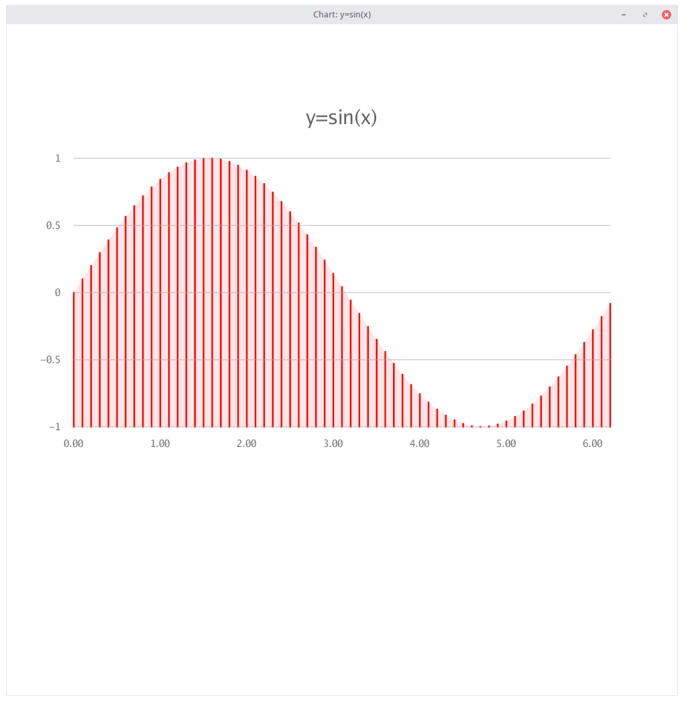
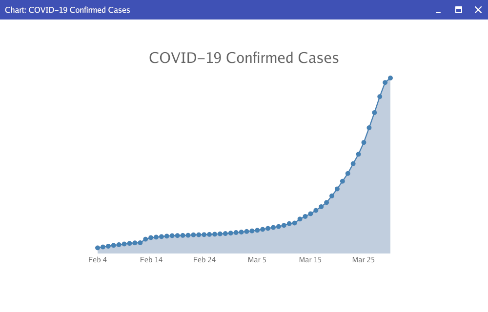
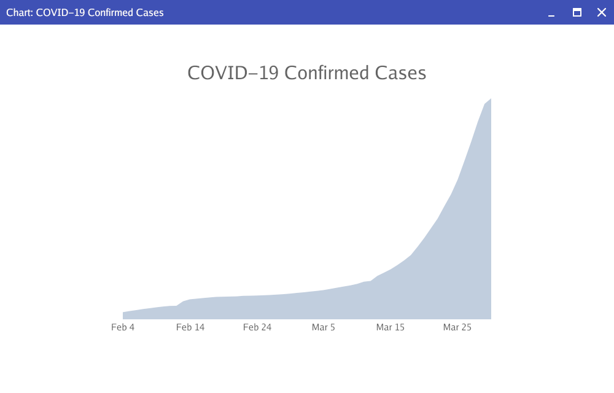
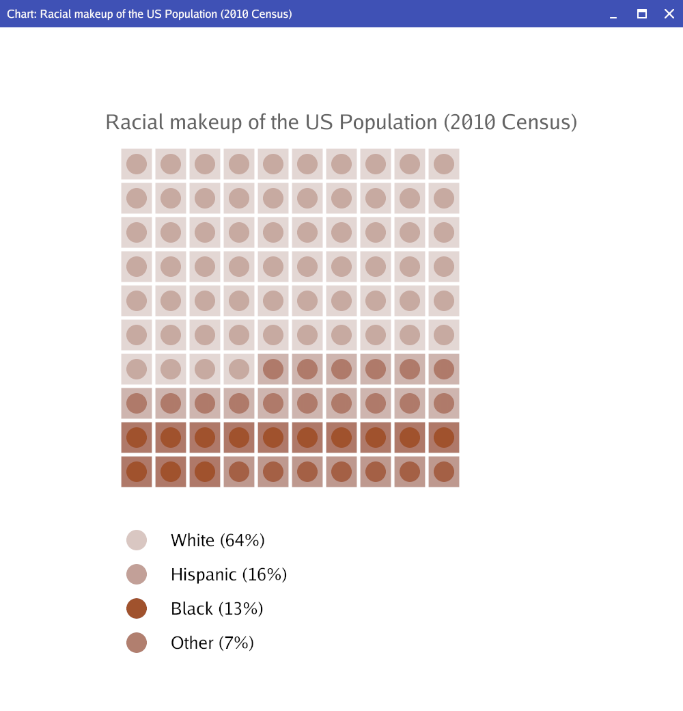
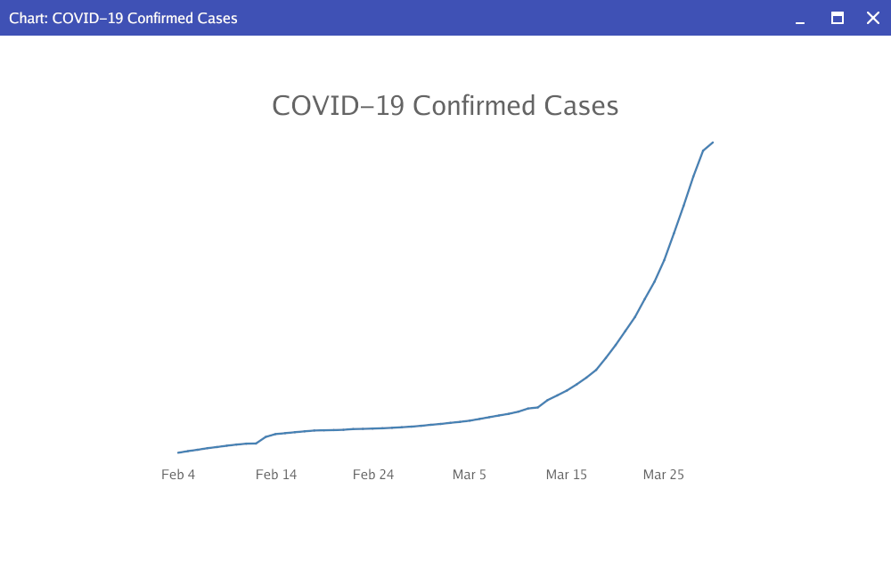
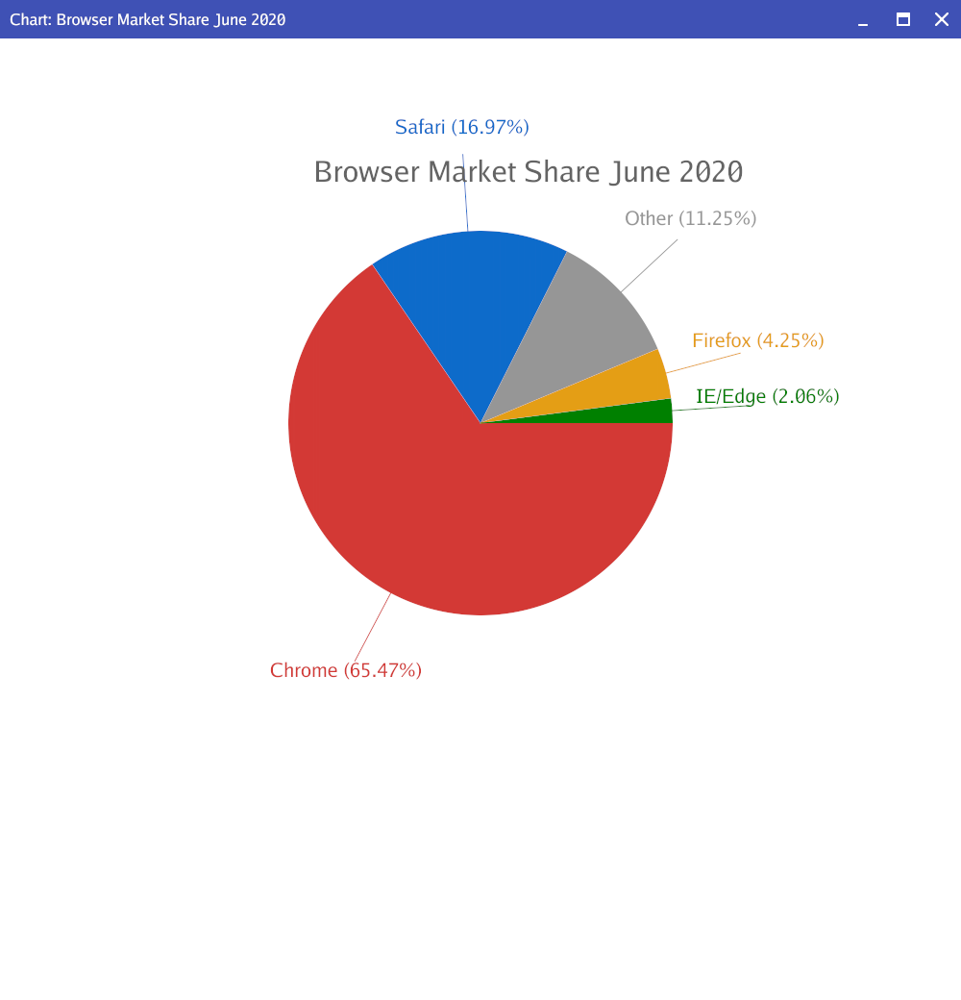
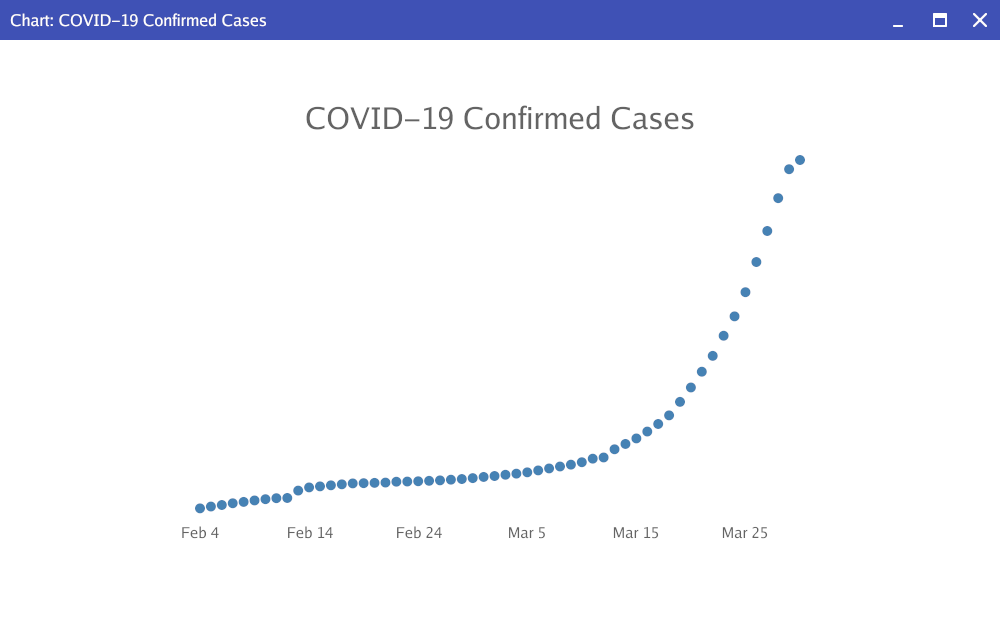

# gchart -- gio canvas charting command



```gchart -bar -area -areaop=20 -zero=f -w 1200 -h 600 -xlabel=10 -barwidth=0.2 -yrange=-1,1,0.5 -grid -color=red sin.d```

## Introduction

gchart makes charts reading data from files or standard input.
The data format is tab-separated, with optional comments.
The first field is a data label and the second is the value.
An optional third field specifying a color is used by the pie and lego chart types.

For example:

```
# Sample Data
one	10
two	20
three	30
four	40
five	50
six	60
seven	70
eight	80
nine	90
ten	100
```

## Chart types

gchart makes several kinds of charts; types may be combined, for example scatter, line and area charts
may be used together.



```gchart -xlabel 10 -h 600 -line -area -scatter c19.d```

### area chart



```gchart -area c19.d```

### bar chart


```gchart -bar -xlabel 10 -h 600 c19.d```

### horizontal bar chart


```gchart -hbar data.d```

### lego chart



```gchart -lego -dotsize 5 pop.d```

### line chart



```gchart -line -xlabel 10 -h 600 c19.d```

### pie chart



```gchart -left 30 -pie  browser.d```

### scatter chart



```gchart -scatter -xlabel 10 -h 600 c19.d```

## Options

Command line options determine the behavior of gchart.
Note that you must specify at least one chart type.

The unit for some of the options
(left, right, top, bottom, barwidth, dotsize, linewidth, ls, piesize, textsize, ty)
refer to the percentage of the canvas.

When specifying colors, you may use named colors ("red"), RGB ("rgb(128,0,0"),
or HSV ("hsv(0,100,0)"). Opacities range from 0-100.

The options are:

```
gchart [options] file

Options     Default               Description
.....................................................................
-area        false                make an area chart
-bar         false                make a bar chart
-hbar        false                make a horizontal bar chart
-lego        false                make a lego chart
-line        false                make a line chart
-pie         false                make a pie chart
-scatter     false                make a scatter chart
.....................................................................
-color       "steelblue"          data color
-labelcolor  "rgb(100,100,100)"   label color
-areaop      50                   area opacity
-frame       0                    frame opacity
.....................................................................
-h           1000                 canvas height
-w           1000                 canvas width
-left        20                   chart left
-top         80                   chart top
-bottom      20                   chart bottom
-right       80                   chaart right
.....................................................................
-barwidth    0.5                  bar width
-dotsize     0.5                  bar width
-linewidth   0.25                 line width
-ls          2                    line spacing
-piesize     20                   pie chart radius
-textsize    1.5                  text size
.....................................................................
-chartitle   ""                   chart title
-ty          5                    title position relative to the top
-xlabel      1                    x-xaxis label interval
-yfmt        "%v"                 yaxis format
-yrange      ""                   y axis range (min,max,step)
.....................................................................
-grid        false                show y axis grid
-title       false                show the title
-zero        true                 zero minumum
......................................................................
```
