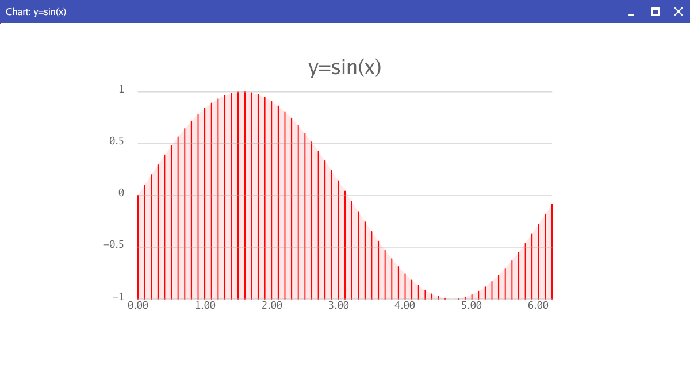

# gchart -- gio canvas charting command



```gchart -bar -area -areaop=20 -zero=f -xlabel=10 -barwidth=0.2 -yrange=-1,1,0.5 -grid -color=red sin.d```

## options
```
-area
  	area chart
-areaop float
  	area opacity (default 50)
-bar
  	bar chart
-barwidth float
  	bar width (default 0.5)
-bgcolor string
  	background color (default "white")
-bottom float
  	chart bottom (default 20)
-chartitle string
  	chart title
-color string
  	color (default "steelblue")
-dotsize float
  	dot size (default 0.5)
-frame float
  	frame opacity
-grid
  	show y axis grid
-h int
  	canvas height (default 1000)
-hbar
  	horizontal bar
-labelcolor string
  	label color (default "rgb(100,100,100)")
-left float
  	chart left (default 20)
-lego
  	lego chart
-line
  	line chart
-linewidth float
  	line width (default 0.25)
-ls float
  	line spacing (default 2)
-pie
  	show a pie chart
-piesize float
  	pie chart radius (default 20)
-right float
  	chart right (default 80)
-scatter
  	scatter chart
-textsize float
  	text size (default 1.5)
-title
  	show the title (default true)
-top float
  	chart top (default 80)
-ty float
  	title position relative to the top (default 5)
-w int
  	canvas width (default 1000)
-xlabel int
  	x-axis label interval (default 1)
-yfmt string
  	yaxis format (default "%v")
-yrange string
  	y axis range (min,max,step)
-zero
  	zero minumum (default true)

```
