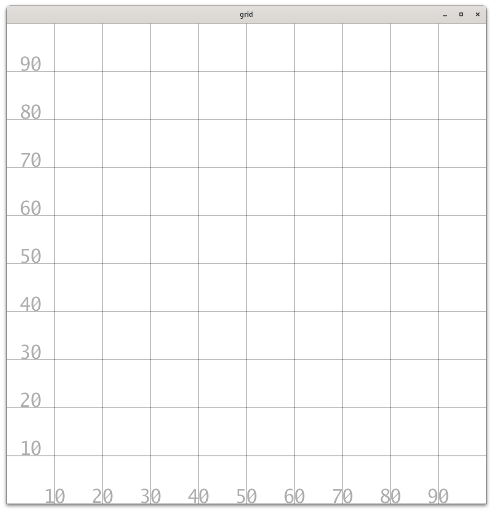

# grid



```
Usage of ./grid:
  -height int
    	canvas height (default 1000)
  -lw float
    	line width (default 0.2)
  -width int
    	canvas width (default 1000)
  -x1 float
    	x begin
  -x2 float
    	x end (default 100)
  -xincr float
    	x increment (default 10)
  -y1 float
    	y begin
  -y2 float
    	y end (default 100)
  -yincr float
    	y increment (default 10)
```
