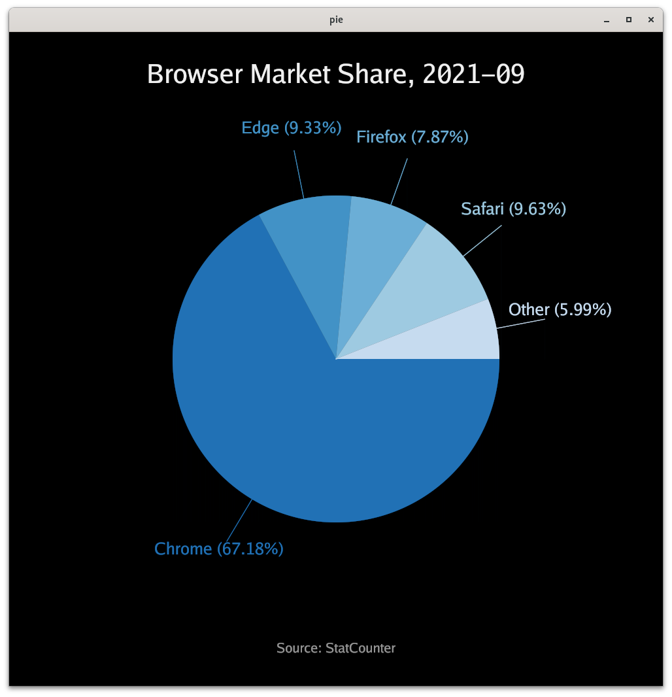

# pie chart

Makes pie charts reading from files in this format:
one line per item, fields (name, value, color; tab-separated)
lines beginning with '#' are the title.

For example:

```
# Desktop Browser Market Share 2021-09
Chrome	67.17	red
Edge	9.33	green
Firefox	7.87	orange
Safari	9.63	blue
Other	5.99	gray
```

If no files a specified, embedded data is shown.  The command line options:

```
  -height int
    	canvas height (default 1000)
  -width int
    	canvas width (default 1000)
```

## Keyboard commands

| Command                                       | Action          |
| --------------------------------------------  | --------------- |
| A, Ctrl-A, ^, 1, Home                         | first slide     |
| E, Crtl-E, $, End                             | last slide      |
| K, F, Ctrl-F, Ctrl-N, Space, Enter            | next slide      |
| J, B, Ctrl-B, Ctrl-P, Shift-Space, Shift-Enter| previous slide  |
| G                                             | toggle a grid   |
| Q, ESC                                        | Quit            |

## Mouse interactions

| Button        | Action          |
| ------------- | --------------- |
| Left          | next slide      |
| Right         | previous slide  |
| Middle        | first slide     |
| Wheel-Forward | next slide      |
| Wheel-Back    | previous slide  |



