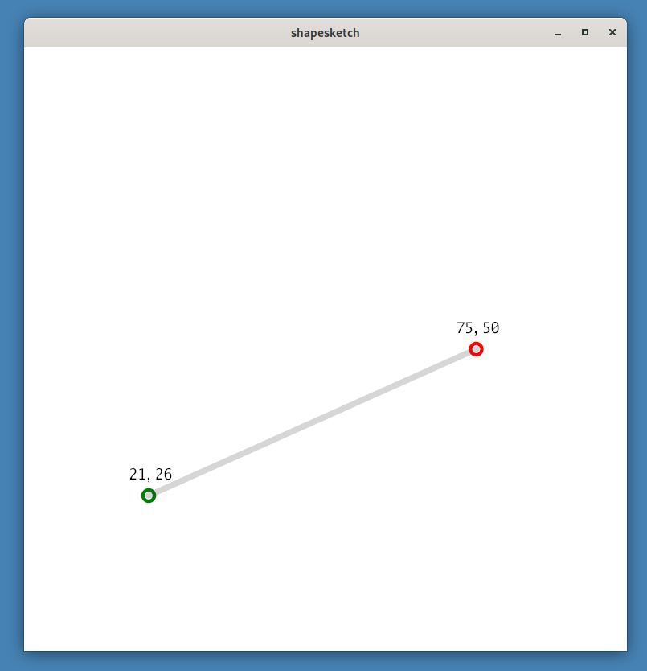

# shapesketch





## Pointer controls

* Primary pointer press: define begin point
* Secondary pointer press: define ending point
* Tertiary pointer press: show the decksh spec
* Move: define current point

## Keyboard controls

* left, right, up, down arrow keys: adjust begin point 
* Ctrl + left, up, down, arrow keys: adjust end point
* D: show the decksh spec
* B: Bezier
* L: line
* C: circle
* E: ellipse
* S: square
* R: rectangle
* G: toggle coordinate grid
* Q, ESC: quit

command flags:
```
  -begincolor string
    	begin coordinate color (default "green")
  -bgcolor string
    	background color (default "white")
  -csize float
    	coordinate size (default 1.25)
  -currentcolor string
    	current coordinate color (default "gray")
  -endcolor string
    	end coordinate color (default "red")
  -height int
    	canvas height (default 1000)
  -lsize float
    	line size (default 1)
  -precision int
    	coordinate precision
  -shapecolor string
    	curve color (default "#22222255")
  -textcolor string
    	text color (default "black")
  -tsize float
    	text size (default 2.5)
  -width int
    	canvas width (default 1000)
```
