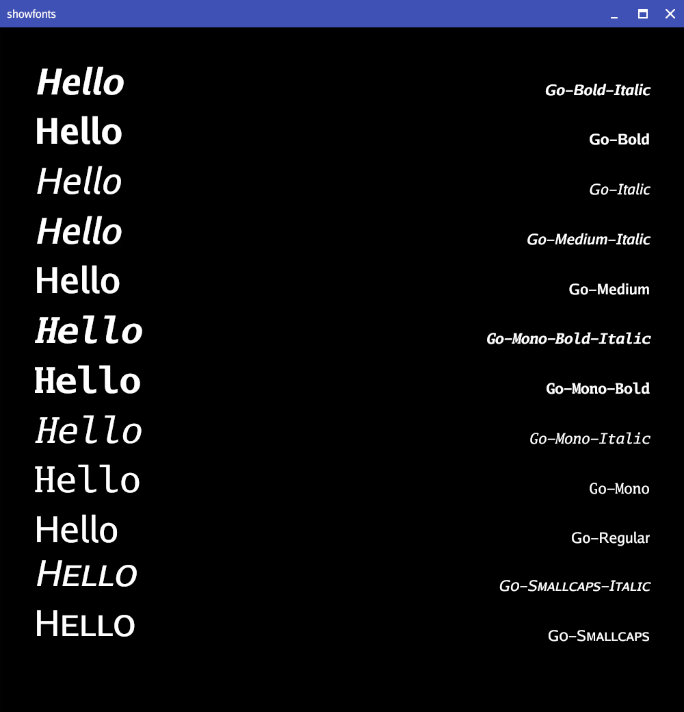
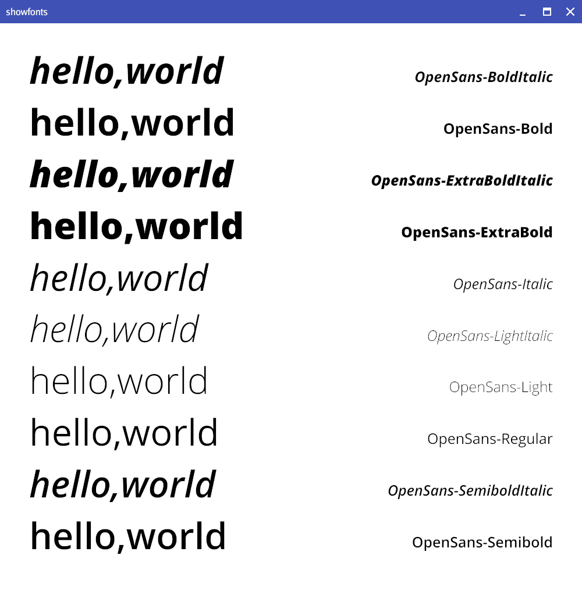

# showfonts

Show fonts


```/showfonts Go*.ttf```



```/showfonts -text Hello -bgcolor black -txcolor white Go*.ttf```



```./showfonts -text hello,world /usr/share/fonts/open-sans/*.ttf```


## options
```
showfonts [options] ttf files...

-bgcolor string
  	background color (default "white")
-height int
  	canvas height (default 1000)
-text string
  	text to show
-ts float
  	text size (0 for autoscale)
-txcolor string
  	text color (default "black")
-width int
  	canvas width (default 1000)
```
