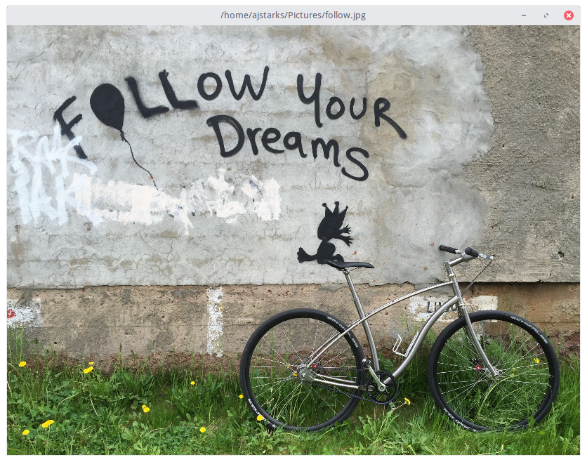

# showimage -- show an image (JPEG, PNG or GIF)

	$ showimage -scale 25 ~/Pictures/follow.jpg



options
```
  -height int
    	canvas height
  -scale float
    	scale (0-100) (default 100)
  -width int
    	canvas width
```
