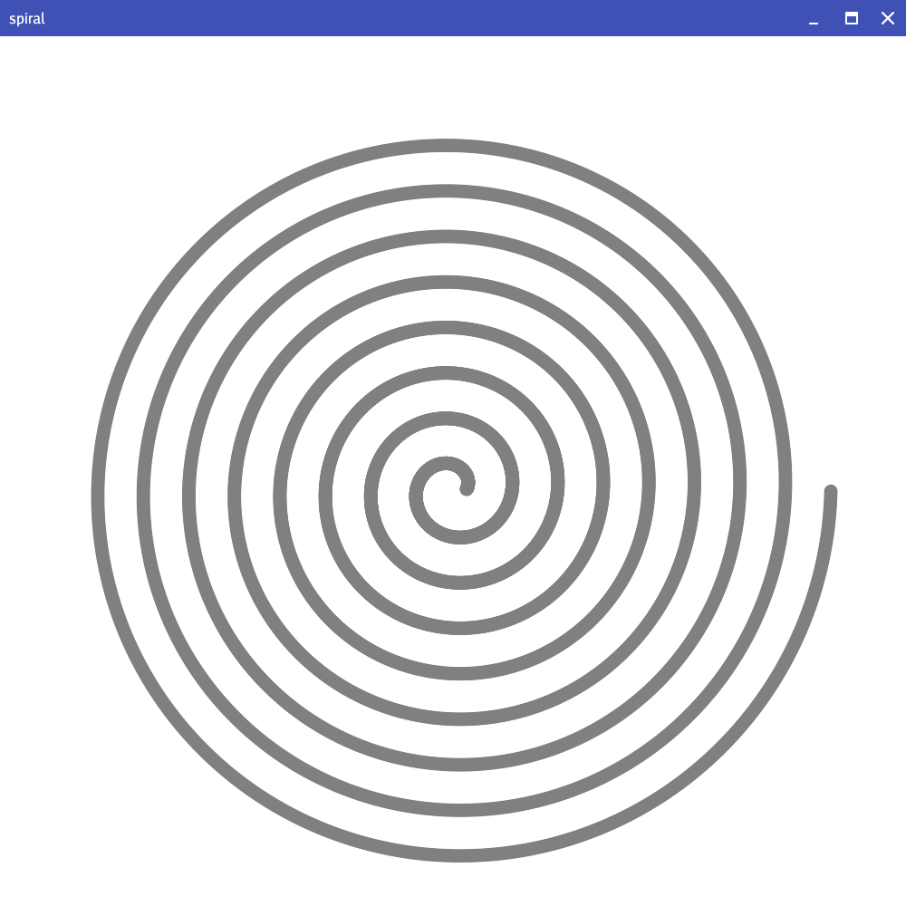

# Spiral



## Options
```
  -a float
    	a (default 1.5)
  -b float
    	b (default 0.8)
  -color string
    	dot color (default "gray")
  -dot float
    	dotsize (default 0.75)
  -height int
    	canvas height (default 1000)
  -incr float
    	increment (default 0.01)
  -n float
    	n (default 16)
  -width int
    	canvas width (default 1000)
```

